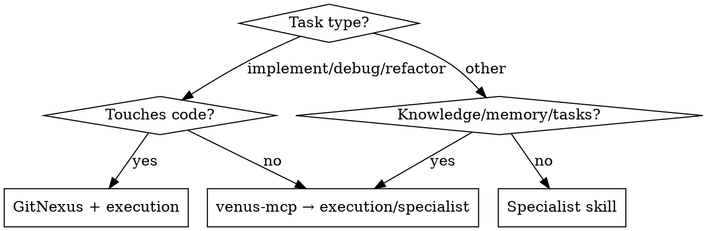

# Skill Selection and Escalation

Choose the right skill, route work correctly, and preserve escalation state in Venus. Venus is canonical for all task state, context, blockers, handoffs, and routing decisions.

## Routing Decision

## Skill Selection Order

1. Use `venus-mcp` when task/context/memory/rules/documents/decisions/handoffs are involved.
2. Use GitNexus skills for code graph exploration, impact, debugging, and refactoring.
3. Use execution skills for implementation plans, TDD, debugging, verification, review, or parallel work.
4. Use specialist skills for UI/UX, browser QA, security, docs, or API design.

**Domain-aware routing:** Run `list_domains` to understand project domain structure and `get_routing_score` to evaluate agent suitability. Record routing decisions in task notes.

## Venus Prelude

Before routing substantial work: (1) run `bootstrap_session`, (2) resolve active project/task, (3) use `get_context_pack`, (4) use `list_domains`, (5) use `get_routing_score` if needed, (6) write before-work handoff with `write_task_section` (section='note').

## Before-Work Handoff for Routed Agents

**REQUIRED:** Follow the before-work handoff protocol in `venus-mcp`.

## During Work

Record meaningful state with Venus task notes for: blocker · rejection · handoff · scope change · high-risk finding · review finding · escalation reason · routing decision.

Use `create_memory_candidate` only for reusable, non-obvious routing lessons. Use `create_proposal` for agent selection decisions when options exist.

## Escalation Rules

Escalate when:

- repeated rejection or failed review indicates unclear spec
- the agent lacks required context or tools
- high-risk code/security/data decision needs human or senior review
- task scope conflicts with rules, conventions, or decisions
- Venus context is missing and durable audit trail is required
- routing decisions need human oversight

Record escalation with: `write_task_section` (section='note', blocker/evidence) · `create_proposal` (unresolved options) · `create_decision` (routing/assignment) · `record_task_outcome` (stop/defer) · `create_task` (follow-up).

## After-Work Handoff

After routed work finishes, pauses, or escalates, write a Venus task note covering: what was done, evidence, decisions, routing outcome, blockers, unresolved questions, follow-up tasks, reusable lessons.

## Graceful Degradation

If Venus MCP is unavailable: ask user to run `knowledge start`. Continue only for low-risk advisory work. Never fabricate task IDs, routing scores, or context packs. Stop before any work requiring durable state or handoff.

## Common Mistakes

- Choosing skills without reading task context
- Ignoring `list_domains` and `get_routing_score` output
- Treating external trackers as canonical task state
- Escalating only in chat with no durable task note
- Re-invoking agents repeatedly without recording rejection/blocker evidence
- Creating memory candidates for routine routing details
- Skipping before-work or after-work handoff for substantial delegated work

## Related Skills

**REQUIRED:** `venus-mcp` — Venus workflow contract

- `task-execution-workflows`
- `startup`
- `write-activity`
- `investigation-handoff`
