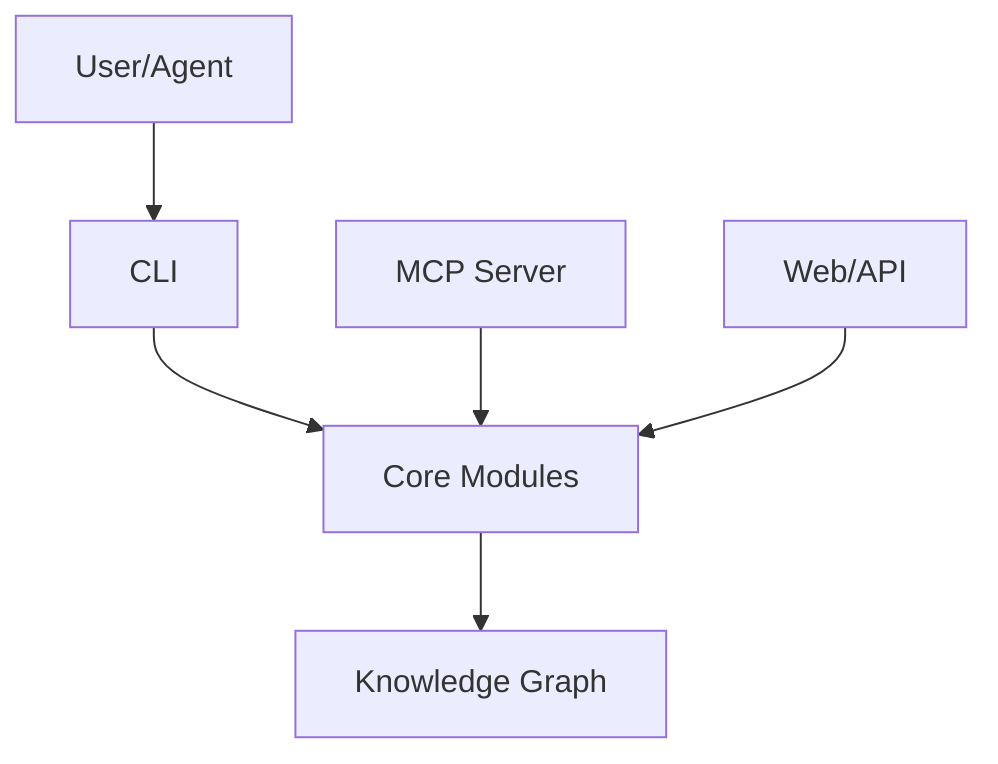

# mindmap-app — Project Brief

> Generated by Venus on 2026-05-05T06:50:07.057Z

## Overview

Knowledge system with 2 modules across 2 domains — 1 conventions.

### Modules

- **Scripts** (`scripts`): Automation and maintenance scripts
- **Documents** (`.venusos/documents`): Structured knowledge documents

---

## Architecture

---

## Workflows

- `venus init` — Initialize a new Venus project
- `venus sync` — Run the knowledge sync pipeline
- `venus brief` — Generate the project brief
- `venus mcp` — Start MCP server for agent integration

---

## Configuration

- `dev`: `next dev`
- `build`: `next build`
- `start`: `next start`
- `lint`: `next lint`

---

## Domains

backend, implementation

---

## References

- `CLAUDE.md`
- `.venusos/.meta/config.json`
- `.venusos/documents`
- `package.json`